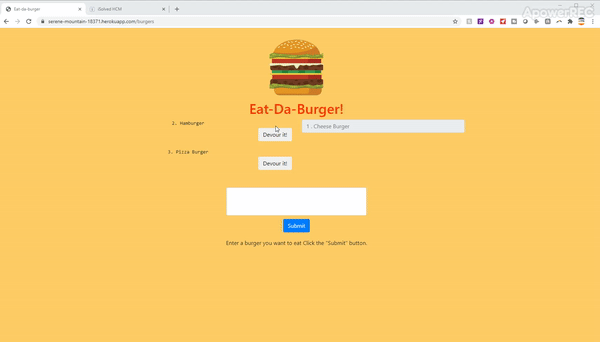

# Eat-A-Burger

What this project does:
This is a burger logger with MySQL, Node, Express, Handlebars and a homemade ORM (yum!).

How this project is useful:
It helps users keep track of what kind of burgers they eat or will eat at the given time they are using the application (no login and history per user was created at this time). 

How users can use the project?:
Simpley log on to https://serene-mountain-18371.herokuapp.com

Users can get help with this project at:
asoler000@gmail.com

Who maintains and contributes to the project?:
As of now only Adriana soler https://github.com/asoler000/ but if you are interested in contributing please feel free to conatact me!
